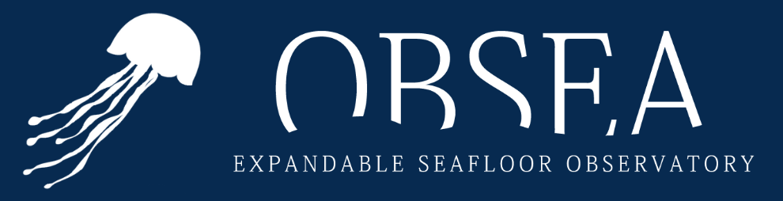

# Ocean Digital Twin - OBSEA

This project is a digital twin application for the OBSEA underwater observatory. It provides a platform for visualizing and interacting with real-time and historical oceanographic data, focusing on environmental parameters like chlorophyll concentration.

The project is structured into two main components:

1.  **Backend:** A robust and efficient Go API responsible for the complex tasks of **automatic data acquisition** from external sources like ERDDAP, **data processing and storage** in a spatiotemporally optimized database, and serving this data to the frontend.
2.  **Frontend:** A modern and responsive web application that provides the **user interface**. It's designed to display the oceanographic data on a **GIS-styled interactive map**, enabling users to explore spatial and temporal patterns.

## Technologies Used

This project leverages the following key technologies across its components:

**Backend:**

- **Go:** The primary programming language, chosen for its performance, concurrency features, and suitability for building reliable backend services.
- **Chi:** A lightweight and fast HTTP router, used for defining and handling the API endpoints efficiently.
- **PostgreSQL:** A powerful, open-source, and feature-rich relational database, serving as the central data repository.
- **PostGIS:** The spatial extension for PostgreSQL, providing advanced capabilities for storing, querying, and analyzing geographic data.
- **Docker & Docker Compose:** Essential tools for containerizing the PostgreSQL database, ensuring a consistent, isolated, and easily deployable environment.
- **NetCDF (via go-native-netcdf):** A Go library used for interacting with NetCDF files, the standard format for many scientific datasets, enabling the reading and processing of oceanographic data.
- **ERDDAP:** An OPeNDAP server that provides access to a wide range of oceanographic datasets, serving as the source for parameters like chlorophyll concentration.

**Frontend:**

- **Vue.js (with TypeScript):** A progressive JavaScript framework for building the user interface, offering a reactive and component-based structure. The use of TypeScript enhances code maintainability and scalability.
- **Mapbox GL JS:** A powerful JavaScript library for rendering interactive maps using WebGL. It's utilized for displaying the GIS-styled map and visualizing the oceanographic data spatially.
- **Tailwind CSS:** A utility-first CSS framework used for rapidly styling the frontend with pre-designed classes, promoting consistency and accelerating development.

## Project Structure

The project is organized into two top-level directories:

- `backend/`: Contains all the code, configuration, and documentation specific to the backend API.
- `frontend/`: Contains all the code, configuration, and documentation specific to the frontend web application.

## Running the Project

Detailed instructions on how to set up and run the backend and frontend components are provided in their respective README files. These guides cover dependencies, configuration, and execution steps for each part of the application.

- For instructions on running the backend, please refer to: [`backend/README.md`](./backend/README.md)
- For instructions on running the frontend, please refer to: [`frontend/README.md`](./frontend/README.md)

## Developed for OBSEA

This digital twin project is a dedicated initiative for the **OBSEA underwater observatory**. Its development is focused on providing tailored solutions for visualizing and interacting with the unique datasets collected by OBSEA, ultimately contributing to marine research, environmental monitoring, and educational outreach related to the observatory.
